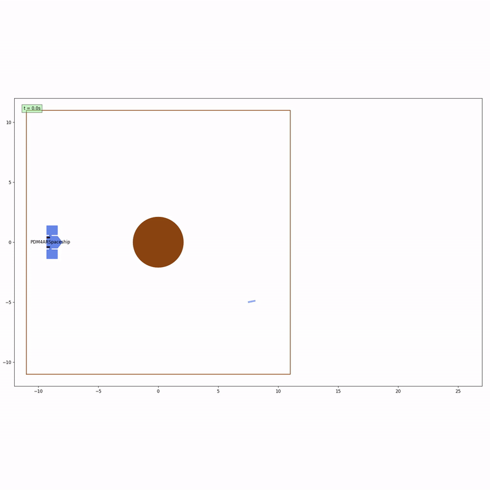
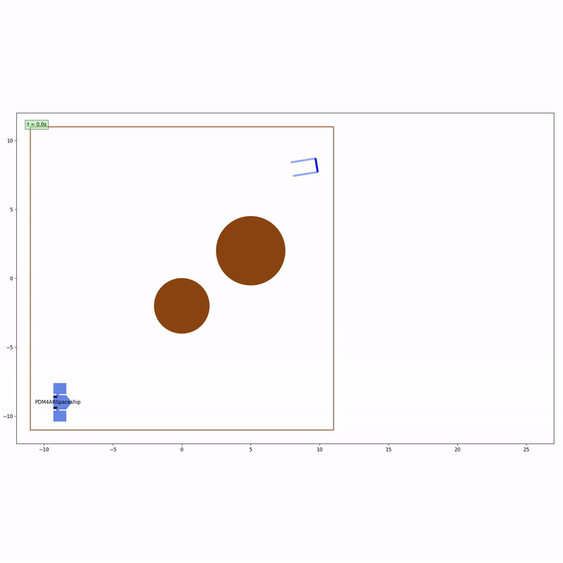
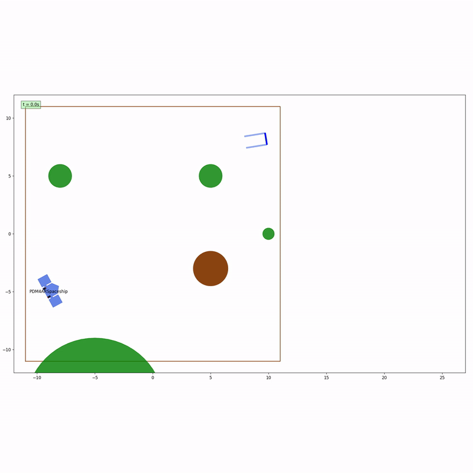

# Satellite Docking Planner

A constrained trajectory planning and closed-loop replanning stack for 2D satellite rendezvous and docking under nonlinear dynamics, bounded thrust, terminal pose constraints, and obstacle avoidance.

## Highlights

- Nonlinear spacecraft dynamics with coupled translation and rotation
- SCvx-style trajectory optimization with trust-region updates
- Static and moving obstacle avoidance
- Docking-oriented terminal position, velocity, and attitude constraints
- Closed-loop execution with replanning
- Time-aware initialization for dynamic obstacles using space-time A*

---

## Performance

The planner was evaluated across multiple scenarios, including static and dynamic obstacle environments.

### Key Metrics

- **Overall success rate**: 98% (59/60)
- **Mean solve time**: ~200 ms per replanning step
- **SCvx iterations**:
  - Static environments: < 10 iterations
  - Dynamic asteroid scenarios: < 25 iterations

### Benchmark Results

| Scenario | Task | Environment | Success Rate | Mean Solve Time | SCvx Iterations |
|----------|------|-------------|--------------|------------------|-----------------|
| Scenario 1 | Goal-reaching | Static planets | 100% (20/20) | 120 ms | < 10 |
| Scenario 2 | Docking | Static planets | 100% (20/20) | 160 ms | < 10 |
| Scenario 3 | Docking | Moving asteroids | 95% (19/20) | 200 ms | < 25 |
| Overall | Mixed | Static + Dynamic | 98% (59/60) | ~200 ms | < 25 |

### Benchmark Setup

- **Hardware**: Apple M2 / 16 GB RAM
- **Solver**: CVXPY with ECOS

### Observations

- The planner converges rapidly in static environments due to stable linearization.
- Dynamic obstacle scenarios require more iterations because obstacle constraints evolve over time.
- Closed-loop replanning significantly improves robustness compared to open-loop execution.

---

## Demo

<p align="center">
  
  
</p>

<p align="center">
  
  
</p>

Additional scenario visualizations and videos are available in:
- `assets/trajectory/`
- `assets/videos/`

---

## Problem

The goal is to generate dynamically feasible satellite trajectories in cluttered environments and drive the vehicle either:
- to a target region, or
- to a valid docking configuration with terminal constraints.

The planner must simultaneously satisfy:

- nonlinear spacecraft dynamics
- bounded thruster actuation
- collision avoidance with static and moving obstacles
- operating boundary constraints
- terminal position, attitude, and velocity requirements
- finite-horizon mission completion

The project covers three main scenario families:

1. **Scenario 1 — Goal-reaching with static planets**
2. **Scenario 2 — Docking with static planets**
3. **Scenario 3 — Docking with static planets and moving asteroids**

---

## Dynamic Model

The satellite state is defined as:

```text
x = [x, y, psi, v_x, v_y, dpsi]
```

where:
- `(x, y)` is position
- `psi` is heading
- `(v_x, v_y)` is translational velocity
- `dpsi` is angular velocity

The control input is:

```text
u = [F_l, F_r]
```

where `F_l` and `F_r` are the left and right thruster forces.

The continuous-time dynamics are:

```text
dx/dt    = v_x
dy/dt    = v_y
dpsi/dt  = dpsi

dv_x/dt  = cos(psi) / m  * (F_l + F_r)
dv_y/dt  = sin(psi) / m  * (F_l + F_r)
ddpsi/dt = l_m / I_z     * (F_r - F_l)
```

The final time is also optimized as part of the decision vector.

---

## Planning Method

The planner follows a **successive convexification-style** optimization loop.

At each replanning step:

1. build an initial trajectory guess
2. linearize the nonlinear dynamics around the current reference trajectory
3. discretize the local model over a finite horizon
4. linearize obstacle-avoidance constraints
5. solve a convex trajectory optimization subproblem
6. evaluate solution quality using a trust-region ratio
7. accept or reject the solution and update the reference trajectory
8. apply the first control command and replan in closed loop

This gives an MPC-like closed-loop planning architecture while keeping the optimization problem tractable.

---

## Initialization Strategy

A naive straight-line initialization is often poor in cluttered or dynamic environments.

To improve convergence, the planner uses a **time-aware A\*** initialization stage for moving-obstacle scenarios:

- dynamic obstacles are frozen over the planning horizon
- a time-sliced occupancy representation is built
- a discrete space-time A\* search generates an initial collision-aware path
- the resulting polyline is resampled into the optimization horizon

This initialization is especially useful when docking must be performed around moving asteroids.

---

## Optimization Structure

The convex subproblem optimizes:
- state trajectory `X`
- control trajectory `U`
- final time `t_f`
- slack variables for dynamics, terminal constraints, control boundary conditions, and obstacle avoidance

The objective combines:
- control effort
- maneuver duration
- terminal docking accuracy
- path regularity
- slack penalties for infeasibility handling

A representative objective is:

```text
J = J_u + J_t + J_goal + J_path + lambda_nu * J_slack
```

where:
- `J_u` penalizes thrust usage
- `J_t` penalizes maneuver time
- `J_goal` enforces precise terminal docking behavior
- `J_path` regularizes trajectory evolution
- `J_slack` penalizes violations of dynamics and safety constraints

---

## Constraint Handling

The planner enforces:

### Dynamics constraints

Linearized and discretized dynamics over the horizon using state-transition matrices.

### Control constraints

Bounded thruster inputs:
- `F_l, F_r ∈ [-F_max, F_max]`

### State-space constraints

The vehicle must remain inside the allowed operating boundary.

### Terminal constraints

The final state must satisfy bounded errors on:
- position
- heading
- linear velocity
- angular velocity

### Obstacle avoidance constraints

Obstacle constraints are linearized around the current reference trajectory.

The implementation supports:
- static planets
- moving asteroids with predicted linear motion
- sub-sampled obstacle checks between knot points for better safety in dynamic scenarios

---

## Discretization

The codebase includes dedicated discretization modules for local trajectory optimization:

- **Zero-Order Hold (ZOH)**
- **First-Order Hold (FOH)**

These modules compute the discrete-time linearized dynamics used by the convex subproblem:

```text
x_(k+1) = A_k x_k + B_k u_k + F_k t_f + r_k
```

or, in the FOH case, with interpolated control contributions across each interval.

The discretization layer also provides:
- nonlinear rollout for validation
- dense trajectory integration
- consistency checks against expected dynamics

---

## Trust-Region SCvx Logic

The planner uses a trust-region update rule to stabilize successive convexification:

- each convex subproblem is solved inside a bounded local trust region
- candidate trajectories are evaluated using a model-accuracy ratio `rho`
- the trust region is expanded or contracted depending on solution quality
- iterations stop when progress becomes sufficiently small

This improves robustness in the presence of:
- nonlinear dynamics
- obstacle constraints
- aggressive terminal docking requirements

---

## Repository Structure

```text
satellite-docking-planner/
├── README.md
├── requirements.txt
├── .gitignore
├── assets/
│   ├── trajectory/
│   │   ├── final_traj.png
│   │   ├── local_debug_traj.png
│   │   ├── scenario1_traj.png
│   │   ├── scenario2_traj.png
│   │   └── scenario3_traj.png
│   └── videos/
│       ├── local_debug.gif
│       ├── local_debug.mp4
│       ├── scenario1.gif
│       ├── scenario1.mp4
│       ├── scenario2.gif
│       ├── scenario2.mp4
│       ├── scenario3.gif
│       └── scenario3.mp4
├── examples/
│   └── run_example.py
├── src/
│   ├── __init__.py
│   └── satellite_docking/
│       ├── __init__.py
│       ├── agent.py
│       ├── discretization.py
│       ├── goal.py
│       ├── planner.py
│       ├── satellite.py
│       ├── utils_params.py
│       └── utils_plot.py
└── tests/
    ├── config_1_public.yaml
    ├── config_2_public.yaml
    ├── config_3_public.yaml
    ├── config_local.yaml
    ├── get_config.py
    └── test_planner.py
```

## Key Files

| File | Role |
|------|------|
| `planner.py` | Main successive convexification planner and trust-region loop |
| `satellite.py` | Symbolic nonlinear spacecraft dynamics and Jacobians |
| `discretization.py` | ZOH / FOH discretization and nonlinear rollout utilities |
| `agent.py` | Closed-loop interface between simulator observations and planner actions |
| `goal.py` | Terminal goal and docking-state handling |
| `utils_params.py` | Planets, asteroids, and scenario parameters |
| `utils_plot.py` | Trajectory visualization and debugging tools |
| `run_example.py` | Quick local execution entry point |

---

## Requirements

To run this project locally, you will need:

- Python 3.10+
- `pip`
- the dependencies listed in `requirements.txt`

Install dependencies with:

```bash
pip install -r requirements.txt
```

---

## Current Status

> **You cannot run full simulation scenarios directly by simply cloning the repository.**

At this stage, the repository provides the planning stack and core algorithms, including:
- trajectory optimization
- constraint handling
- discretization logic
- closed-loop planning structure

The full simulation environment and end-to-end execution pipeline are not yet fully packaged for plug-and-play use.

---

## Quick Start (Current)

You can explore the planner logic locally with:

```bash
python -m examples.run_example
```

You can also modify the scenario configuration files in `tests/` for debugging and experimentation.

---

## Testing

Basic tests are available with:

```bash
pytest tests/test_planner.py
```

For future reproducibility and standardized execution, the recommended direction is to move toward a fully containerized Docker workflow.

---

## What This Project Demonstrates

This repository demonstrates practical implementation of:

- nonlinear trajectory optimization
- constrained motion planning
- docking-oriented terminal guidance
- trust-region based successive convexification
- dynamic obstacle avoidance
- closed-loop planner/simulator integration
- modular robotics and aerospace software design

---

## Current Limitations

The current implementation is intentionally focused and still has several limitations:

- the problem is restricted to planar (2D) spacecraft motion
- moving-obstacle prediction is based on simple linear models
- convergence depends on initialization quality
- solve time may grow in heavily cluttered environments
- the planner does not yet model uncertainty or robust chance constraints
- the full simulation environment is not yet packaged for direct end-to-end execution after cloning the repository
- no full 6-DoF spacecraft dynamics are included yet

These are natural next steps for extending the planner toward more realistic autonomous guidance settings.

---

## Future Improvements

Possible improvements include:

- adding a full Dockerfile and containerized test workflow for reproducible execution
- packaging the full simulation environment for end-to-end execution
- enabling one-command scenario execution through a cleaner CLI workflow
- adding CI support to automatically run tests inside Docker
- full 6-DoF spacecraft dynamics
- more advanced obstacle prediction models
- warm-start policies for faster replanning
- improved trust-region adaptation
- benchmark reporting across scenarios
- solver runtime and convergence profiling
- robustness to state-estimation uncertainty

A future reproducible workflow would look like:

```bash
docker build -t satellite-docking-planner .
docker run --rm satellite-docking-planner
```

---

## Author

Ilias Drissi